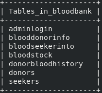
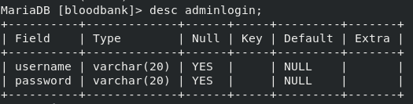
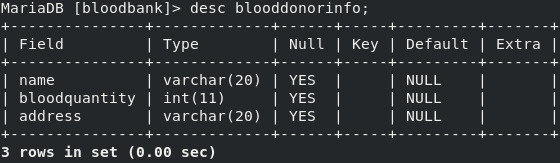
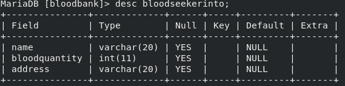
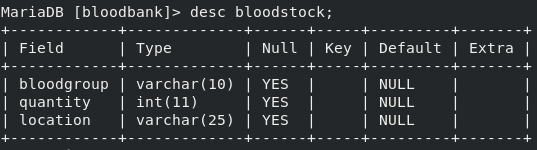
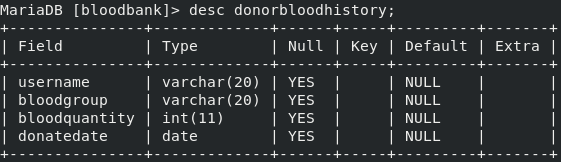
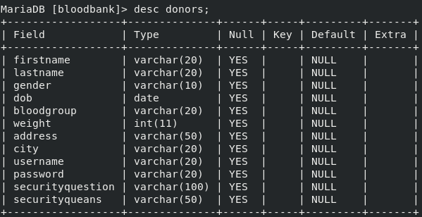
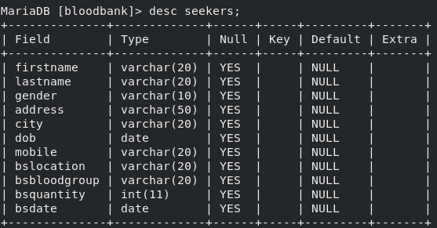

# Requirements -
  1) Apache Tomcat Server Installation
  2) Database setup [MySQL or MariaDB]
  3) Any Browser
  
# Apache Tomcat  
  1) Download And Install Tomcat from official website (https://tomcat.apache.org/)
 
# Database setup
  1) create database with name bloodbank
  2) create tables according to images given below   
                            
   
   
   
   
   
   
   

          
# Before Execution of project
  Move project files folder into /path_to_apache_installed_folder/apache_folder_name/webapps/

# Project Execution Process -
  1) Open browser
  2) Enter URL localhost:8080/project_folder_name/homepage.html and hit Enter.
  3) You will be get the Homepage of the project.

